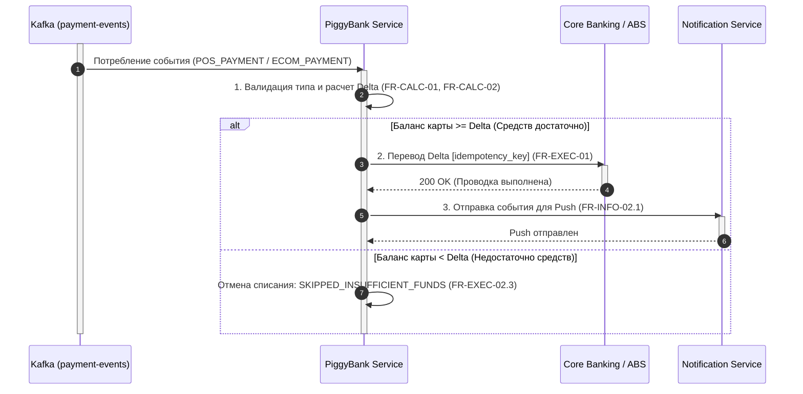
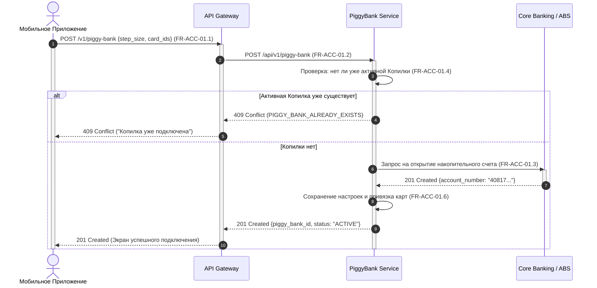
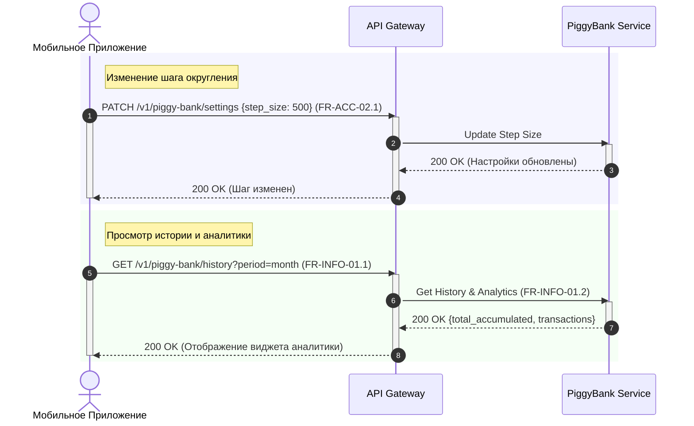

# 03. Модели процессов

В данном разделе представлены модели ключевых бизнес-процессов и сценарии взаимодействия микросервиса «Копилка» со смежными системами Банка.

---

## 1. Процесс подключения сервиса «Копилка» (BPMN)

Данный процесс описывает пользовательский сценарий создания Копилки в Мобильном приложении, включая пошаговую валидацию, выбор параметров и открытие счета в банковском ядре (Core Banking / АБС).

### Диаграмма бизнес-процесса BPMN

---

## 2. Интеграционные сценарии (Sequence Diagrams)

Для удобства проектирования и разработки взаимодействие микросервисов разбито на 3 ключевых изолированных сценария.

---

### 2.1. Сценарий A: Автопополнение сдачи при покупке (Event-Driven / Kafka)

**Описание:**  
Асинхронный процесс обработки транзакций. Микросервис вычитывает события транзакций из Kafka, рассчитывает сумму округления (Delta), проверяет остаток на карте клиента в АБС и выполняет автоматический перевод средств в Копилку.

---

### 2.2. Сценарий B: Подключение сервиса «Копилка» (REST API)

**Описание:**  
Синхронный REST-запрос от Мобильного приложения при завершении мастера подключения. Сервис проверяет бизнес-правило (одна Копилка на клиента) и инициирует открытие накопительного счета в банковском ядре (АБС).

---

### 2.3. Сценарий C: Управление настройками и просмотр аналитики

**Описание:**  
Пользовательские сценарии управления уже созданной Копилкой: изменение шага округления (настройки вступают в силу для новых покупок) и получение истории накоплений с аналитикой за период.

