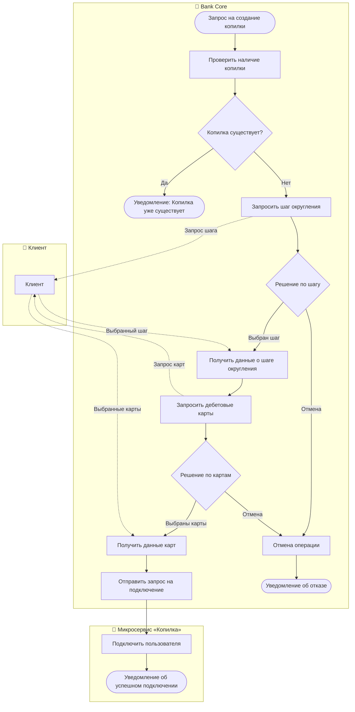

# 03. Модели процессов

В данном разделе представлены модели ключевых бизнес-процессов и сценарии взаимодействия микросервиса «Копилка» со смежными системами Банка.

---

## 1. Процесс подключения сервиса «Копилка» (BPMN / Flowchart)

Данный процесс описывает пользовательский сценарий создания Копилки в Мобильном приложении, включая бизнес-валидацию на стороне микросервиса и открытие счета в банковском ядре (Core Banking / АБС).

### Диаграмма процесса

