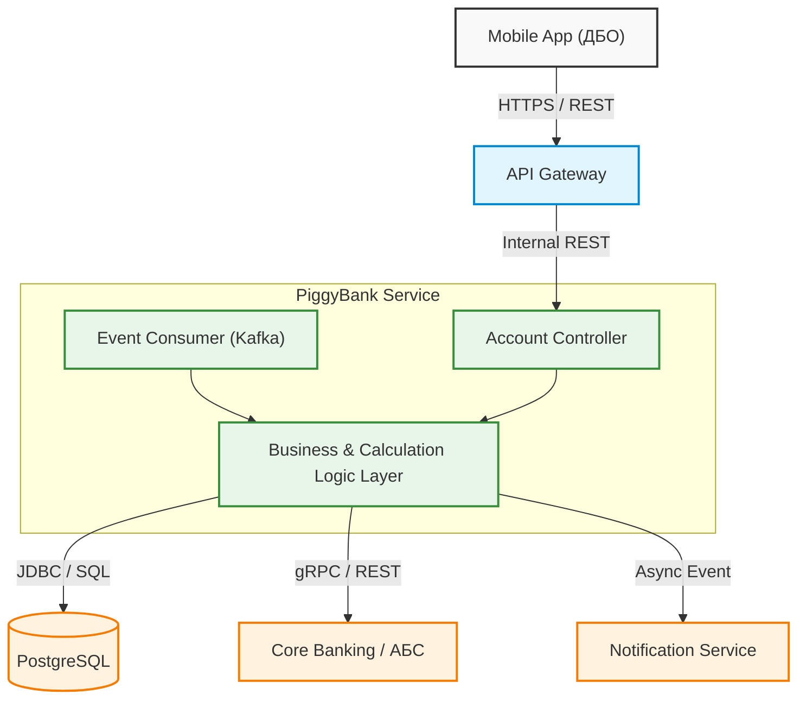

# 04. Архитектура и спецификация API

В данном разделе описаны техническая архитектура микросервиса «Копилка», схемы интеграционных контрактов (REST API и Kafka), а также форматы данных и правила обработки ошибок.

---

## 1. Архитектурный обзор

Микросервис **PiggyBank Service** проектируется в рамках событийно-ориентированной (Event-Driven) и микросервисной архитектуры Банка.



### Архитектурные принципы:
1. **Изоляция домена:** Микросервис отвечает исключительно за бизнес-логику расчета округлений, хранение настроек пользователей и историю зачислений.
2. **Делегирование транзакций:** Непосредственные межсчетные переводы и хранение денег осуществляются в **Core Banking (АБС)**.
3. **Идемпотентность:** Все операции пополнения содержат уникальный ключ идемпотентности `idempotency_key` для защиты от дублирования списаний при сетевых сбоях.

---

## 2. REST API Спецификация

Все REST-эндпоинты предоставляются через **API Gateway**. Авторизация выполняется на уровне Gateway (Bearer JWT), микросервис получает контекст авторизованного клиента в HTTP-заголовках (`X-User-Id`).

### Обзор эндпоинтов

| Метод | Эндпоинт | Назначение | FR |
| :--- | :--- | :--- | :--- |
| `POST` | `/v1/piggy-bank` | Подключение сервиса «Копилка» | FR-ACC-01 |
| `GET` | `/v1/piggy-bank` | Получение текущих настроек и статуса | FR-ACC-01, FR-ACC-02 |
| `PATCH` | `/v1/piggy-bank/settings` | Изменение шага округления / статуса | FR-ACC-02 |
| `GET` | `/v1/piggy-bank/history` | Получение истории накоплений и аналитики | FR-INFO-01 |

---

### 2.1. Подключение сервиса «Копилка»

* **HTTP Method:** `POST`
* **Path:** `/api/v1/piggy-bank`
* **Описание:** Создает Копилку для авторизованного пользователя и привязывает указанные дебетовые карты.

#### Request Headers:
```http
Content-Type: application/json
X-User-Id: 550e8400-e29b-41d4-a716-446655440000
```

#### Request Body:
```json
{
  "step_size": 100,
  "card_ids": [
    "card-uuid-1111-2222",
    "card-uuid-3333-4444"
  ]
}
```

#### Response (201 Created):
```json
{
  "piggy_bank_id": "pb-8877-9900-1122",
  "status": "ACTIVE",
  "account_number": "40817810000001234567",
  "step_size": 100,
  "card_ids": [
    "card-uuid-1111-2222",
    "card-uuid-3333-4444"
  ],
  "created_at": "2026-08-04T12:00:00Z"
}
```

---

### 2.2. Изменение настроек (Шаг округления)

* **HTTP Method:** `PATCH`
* **Path:** `/api/v1/piggy-bank/settings`
* **Описание:** Изменяет шаг округления или переводит Копилку в режим паузы/активности.

#### Request Body:
```json
{
  "step_size": 500,
  "status": "ACTIVE"
}
```

#### Response (200 OK):
```json
{
  "piggy_bank_id": "pb-8877-9900-1122",
  "status": "ACTIVE",
  "step_size": 500,
  "updated_at": "2026-08-04T12:35:00Z"
}
```

---

### 2.3. История накоплений и аналитика

* **HTTP Method:** `GET`
* **Path:** `/api/v1/piggy-bank/history?period=month&limit=20&page=1`
* **Описание:** Возвращает общую сумму накоплений и список транзакций зачислений.

#### Query Parameters:
* `period` *(optional)*: `day` | `month` | `year` | `all` (Default: `month`)
* `limit` *(optional)*: `integer` (Default: `20`)
* `page` *(optional)*: `integer` (Default: `1`)

#### Response (200 OK):
```json
{
  "summary": {
    "total_accumulated": 12450.00,
    "currency": "RUB",
    "period": "month",
    "operations_count": 48
  },
  "items": [
    {
      "transaction_id": "tx-abc-123",
      "timestamp": "2026-08-04T10:15:20Z",
      "original_amount": 235.00,
      "rounded_amount": 300.00,
      "delta": 65.00,
      "card_last_digits": "4321",
      "merchant_name": "KFC",
      "status": "SUCCESS"
    }
  ],
  "pagination": {
    "current_page": 1,
    "total_pages": 3,
    "total_items": 48
  }
}
```

---

## 3. Асинхронное взаимодействие (Kafka AsyncAPI)

Микросервис потребляет события из Kafka-топика процессинга и публикует события для push-уведомлений.

### 3.1. Входящий топик: `payment-events` (Consumer)

* **Consumer Group:** `piggy-bank-service-group`
* **Сценарий:** Обработка операций по карте в реальном времени.

#### Пример сообщения (Value Schema):
```json
{
  "event_id": "evt-9988-7766",
  "event_type": "POS_PAYMENT",
  "transaction_id": "tx-abc-123",
  "user_id": "550e8400-e29b-41d4-a716-446655440000",
  "card_id": "card-uuid-1111-2222",
  "amount": 235.00,
  "currency": "RUB",
  "merchant_details": {
    "mcc": "5814",
    "name": "KFC Moscow"
  },
  "timestamp": "2026-08-04T10:15:18Z"
}
```

---

### 3.2. Исходящий топик: `notification-events` (Producer)

* **Сценарий:** Отправка команды на формулирование Push-уведомления клиенту.

#### Пример сообщения (Value Schema):
```json
{
  "event_id": "notif-1122-3344",
  "user_id": "550e8400-e29b-41d4-a716-446655440000",
  "notification_type": "PUSH",
  "template_code": "PIGGY_BANK_TOPUP_SUCCESS",
  "payload": {
    "purchase_amount": "235 ₽",
    "delta_amount": "65 ₽",
    "total_accumulated": "12 450 ₽"
  },
  "timestamp": "2026-08-04T10:15:21Z"
}
```

---

## 4. Обработка ошибок (Error Handling)

В случае возникновения ошибок REST API возвращает стандартный JSON-ответ в формате RFC 7807 (Problem Details).

### Структура ответа с ошибкой:
```json
{
  "type": "https://api.bank.ru/errors/PIGGY_BANK_ALREADY_EXISTS",
  "title": "Conflict",
  "status": 409,
  "code": "PIGGY_BANK_ALREADY_EXISTS",
  "detail": "У пользователя уже есть активная Копилка.",
  "timestamp": "2026-08-04T12:00:00Z"
}
```

### Справочник кодов ошибок

| HTTP Code | Error Code | Описание / Причина |
| :--- | :--- | :--- |
| `400` | `INVALID_STEP_SIZE` | Передан недопустимый шаг округления (допустимы: 10, 50, 100, 500). |
| `400` | `INVALID_CARD_TYPE` | Попытка привязать не дебетовую карту (например, кредитную). |
| `404` | `PIGGY_BANK_NOT_FOUND` | У пользователя отсутствует подключенный сервис Копилки. |
| `409` | `PIGGY_BANK_ALREADY_EXISTS` | У пользователя уже существует активная Копилка (FR-ACC-01.4). |
| `500` | `ABS_INTEGRATION_ERROR` | Ошибка связи с Core Banking при открытии счета. |
| `503` | `SERVICE_UNAVAILABLE` | Сервис временно недоступен. |