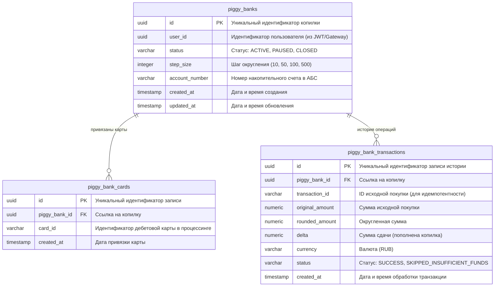

# 05. Модель данных

В данном разделе представлена реляционная модель базы данных микросервиса **PiggyBank Service**. Для хранения данных используется **PostgreSQL**. Модель оптимизирована под высокую скорость чтения настроек, изоляцию данных пользователя и гарантию идемпотентности при обработке финансовых транзакций из Kafka.

---

## 1. ER-диаграмма базы данных

---

## 2. Описание таблиц и полей

### 2.1. Таблица `piggy_banks` (Основные настройки Копилки)
Хранит общую информацию о подключенном сервисе для каждого клиента (одна активная копилка на пользователя в рамках FR-ACC-01.4).

| Поле | Тип данных | Обязательно | Описание |
| :--- | :--- | :--- | :--- |
| `id` | `UUID` | Да | Первичный ключ (PK), сгенерирован на стороне сервиса. |
| `user_id` | `UUID` | Да | Идентификатор клиента. Имеет уникальный индекс (`UNIQUE`), гарантирующий правило «одна копилка на пользователя». |
| `status` | `VARCHAR(20)` | Да | Текущий статус сервиса: `ACTIVE`, `PAUSED`, `CLOSED`. |
| `step_size` | `INTEGER` | Да | Выбранный шаг округления (допустимые значения: `10`, `50`, `100`, `500`). |
| `account_number` | `VARCHAR(34)` | Да | Номер накопительного счета, открытого в Core Banking / АБС (формат IBAN / расчетный счет). |
| `created_at` | `TIMESTAMP` | Да | Метка времени создания записи (`DEFAULT CURRENT_TIMESTAMP`). |
| `updated_at` | `TIMESTAMP` | Да | Метка времени последнего изменения настроек. |

---

### 2.2. Таблица `piggy_bank_cards` (Привязанные дебетовые карты)
Содержит список дебетовых карт клиента, с транзакций которых разрешено производить расчет сдачи (в соответствии с FR-ACC-01.6).

| Поле | Тип данных | Обязательно | Описание |
| :--- | :--- | :--- | :--- |
| `id` | `UUID` | Да | Первичный ключ (PK). |
| `piggy_bank_id` | `UUID` | Да | Внешний ключ (FK) на таблицу `piggy_banks`. |
| `card_id` | `VARCHAR(64)` | Да | Идентификатор карты в процессинговом центре банка. |
| `created_at` | `TIMESTAMP` | Да | Метка времени привязки карты к копилке. |

---

### 2.3. Таблица `piggy_bank_transactions` (История зачислений и расчетов)
Логирует все входящие транзакции из Kafka-топика, по которым производилась проверка и расчет округления (включая пропущенные из-за нехватки средств).

| Поле | Тип данных | Обязательно | Описание |
| :--- | :--- | :--- | :--- |
| `id` | `UUID` | Да | Первичный ключ (PK). |
| `piggy_bank_id` | `UUID` | Да | Внешний ключ (FK) на таблицу `piggy_banks`. |
| `transaction_id` | `VARCHAR(64)` | Да | Уникальный идентификатор исходной покупки из процессинга. Используется для обеспечения идемпотентности (`UNIQUE`). |
| `original_amount` | `NUMERIC(12, 2)` | Да | Сумма оригинальной транзакции (покупки). |
| `rounded_amount` | `NUMERIC(12, 2)` | Да | Сумма после округления вверх (`Math.ceil`). |
| `delta` | `NUMERIC(12, 2)` | Да | Рассчитанная сумма сдачи (переведена в копилку или равна 0). |
| `currency` | `VARCHAR(3)` | Да | Код валюты (например, `RUB`). |
| `status` | `VARCHAR(30)` | Да | Результат обработки: `SUCCESS` (успешно переведено) или `SKIPPED_INSUFFICIENT_FUNDS` (отменено из-за нехватки средств). |
| `created_at` | `TIMESTAMP` | Да | Метка времени обработки события. |

---

## 3. Индексы и ограничения (Constraints)

Для обеспечения высокой производительности (поддержка высоких нагрузок от Kafka-потока транзакций) и целостности данных создаются следующие индексы:

1. **`uk_piggy_banks_user_id`** (`UNIQUE` на `piggy_banks.user_id`) — техническая реализация бизнес-требования об одной копилке на клиента.
2. **`uk_piggy_bank_transactions_tx_id`** (`UNIQUE` на `piggy_bank_transactions.transaction_id`) — ключевой элемент защиты от дублирования проводок при повторной доставке сообщений из Kafka (At-Least-Once Delivery).
3. **`idx_piggy_bank_tx_date`** (`BTREE` на `piggy_bank_transactions(piggy_bank_id, created_at)`) — составной индекс для быстрой генерации отчетов по истории накоплений за период (день, месяц, год) в соответствии с `FR-INFO-01`.